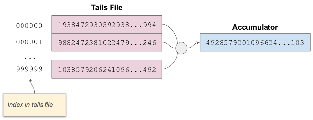
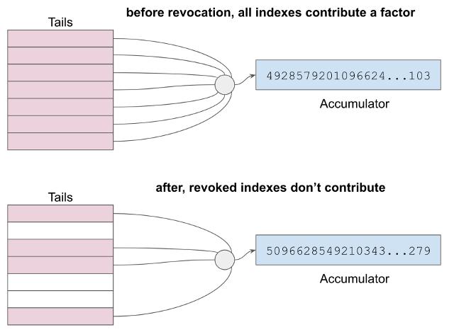

# How Credential Revocation Works

This doc aims to explain credential revocation at a conceptual level.
If this doc still feels too low-level, you might consider watching [this
introductory video](https://drive.google.com/open?id=1FxdgkYwwLfpln6MnsZJAwnYjM6LpCoP0) from time offset 0:30 to 4:30.

## Background: Cryptographic Accumulators

Before explaining the mechanism in detail, it's necessary to understand
__cryptographic accumulators__ at a very high level.
We will try to avoid daunting math in our explanation.

You can think of an accumulator as the product of multiplying many numbers
together. In the equation `a * b * c * d = ` __`e`__,
the accumulator would be __`e`__;
it _accumulates_ a value as each new factor is multiplied in. We could
plug in numbers; if `a`=2 and `b`=3 and `c`=5 and `d`=7, then our accumulator
__`e`__ has a value of 210. If `e` has this value, we
say that 3 is "in" `e` because it is a factor. If we want to take 3 out
of the accumulator, we divide 210 by 3 and get 70 (=2*5*7); 3 has now been
"removed".

Notice that you can also produce __`e`__ by multiplying any single
factor such as `a` by the product of all the other factors (`b * c * d`).
This is a useful characteristic; it means you can tell someone else
the value of `a` and _the product of all the other inputs to the accumulator,
but not the other inputs themselves_, and they can produce the output.

## Background: Tails Files

In our simple example above, we only have 4 factors, and we are using small
numbers. We are also using standard arithmetic, where you can reverse
multiplication by dividing. In such a system, the contents of an accumulator
can be reverse-engineered by simple prime factorization.

To be useful for revocation, Indy's accumulators can't be reversible; that is,
it must be the case that the only way to derive the accumulator
value is to know the factors.
We accomplish this by using modular arithmetic (where division is undefined),
and by using massive numbers for the factors and accumulators.

A __tails file__ is associated with an accumulator
and its factors. It is a binary file that contains an
array of randomly generated factors for an accumulator. Instead of small
numbers like 2 and 3 and 7, these factors are massive numbers, far too
big to display conveniently on a screen. Typically the quantity of these
numeric factors in a tails file is large--hundreds of thousands to tens of
millions.

A tails file is not secret; it is published as plain text to the world
and freely downloadable by anyone. The contents of this file never change.

Each potential or actual credential issued by a particular issuer is
assigned an index to an accumulator factor in a tails file. However,
only credentials that have not been revoked contribute to the value of the
accumulator. We will see how this works, below.

## Setup

Before revocable credentials can be issued, a number of things must be
true about the ecosystem:

1. A __schema__ for each credential type
   must be written to the ledger.
   For example, if companies wish to issue proof of employment, then
   a "Employee Credential" schema would need to be published. Similarly,
   before birth certificate credentials can be issued, a "Birth Certificate"
   schema would need to be defined and made available to the public. Any number
   of issuers can reference the same schema. Schemas can be versioned and
   evolved over time. Any individual or institution can write a schema
   to the ledger; it does not require special privileges.

2. Each issuer must publish on the ledger one __
   credential definition__ for each credential type they intend
   to create. The definition announces the issuer's intention to
   create credentials that match a particular schema, and specifies the
   keys that the issuer will use to sign such credentials. (The verkey+
   signing key pair used to authenticate the issuer's DID should be kept
   separate from the keys used to sign credentials, so that each key
   pair can be rotated independently; it would be bad if a sysadmin
   rotated a DID keypair and accidentally invalidated all credentials
   issued by an institution...)

3. Each issuer must also publish on the ledger a __
   revocation registry__. This metadata references a credential definition and
   specifies how revocation for that credential type will be handled.
   The revocation registry tells which cryptographic __
   accumulator__ can be used to test revocation, and gives the URI and
   hash of the associated __tails file__.

4. Each issuer must publish on the ledger an accumulator value that
   describes the revocation status for all associated credentials. This
   accumulator must be updated on a periodic or as-needed basis. For
   example, if a driver's license division revokes 3 licenses during a
   given work day, then when they close their doors at 5 pm, they might
   issue a ledger transaction that updates the accumulator value for
   their driver's license credentials, removing the 3 revoked credentials
   from the accumulator. What we mean by "removing" is as described above--
   the factors listed in the tails file for the indexes associated with
   the 3 revoked credentials are no longer multiplied into the accumulator.

## How Revocation Will Be Tested

Let us now skip ahead to think about what needs to happen much later.
When a prover gives proof to a verifier, we normally think about the proof
as focusing on core information demands: _What is your birthdate?_ _Please
disclose your address_. This is __primary proof__.

But there is another dimension of proof that's also necessary: _The prover
must demonstrate that the credentials behind the primary proof have not
been revoked._ This is called __proof of non-revocation__.

In Indy, proof of non-revocation is accomplished by having provers show
that they can derive the value of the accumulator for their credential
using a factor for the accumulator that they know, plus the product of
all other factors.
The verifier can see that the prover produces the right answer (because
the answer is on the ledger), but does not know certain details of how the
prover derived it. The issuer can revoke by changing the answer to the
math problem in a way that defeats the prover.

## Preparing for Revocation at Issuance

When a credential is issued, the actual credential file is transmitted
to the holder (who will later become a prover). In addition, the issuer
communicates two other pieces of vital information:

* The index corresponding to this credential, in the tails file. This
  lets the holder look up their private factor, which we could map to
  `a` in the simple equation from the accumulator background section
  at the top of the doc.
* The product of the _other_ factors contributing to the accumulator (all
  factors except the private one for this credential).
  This value is like `b * c * d` from the simple equation above, and
  is called a __witness__.

## Presenting Proof of Non-Revocation

When the prover needs to demonstrate that her credential is not revoked,
she shows that she can provide math that derives the accumulator value
on the ledger using her private factor times the witness. She does this
without actually disclosing what her private value is; this is important
to avoid correlation.

But there is a complication: what if the accumulator has changed value
since the time the credential was issued? In this case, the private
factor times the witness will not equal the accumulator...

This is handled by requiring accumulator updates to also publish a
__witness delta__ as part of the same transaction.
This tells provers how to adjust their witness (referencing other indexes
in the public tails file) to bring it back into
harmony with the current value of the accumulator. Updating witnesses
requires the prover (but not the verifier) to download the tails file.

## Putting It All Together

This discussion has suppressed some details. The math has been simplified,
and we haven't discussed how an issuer copes with multiple tails files
and revocation registries, or why that might be desirable. However, the
broad flow of the mechanism should be apparent, and its features are
now easy to summarize:

* Issuers revoke by changing a number on the ledger. They can revoke
  as many credentials as they want in a single transaction, since
  they are just changing the answer to a math problem that either does
  or doesn't include the factors they choose. Issuers do not have to
  contact anybody--provers or verifiers--to revoke. Changes take place
  globally, the instant the accumulator update transaction appears
  on the ledger.
* Revocation is reversible.
* Provers demonstrate proof of non-revocation in a privacy-preserving
  way. They cannot be correlated by something like a credential ID or
  a tails index. This is radically different from a revocation list
  approach, which requires correlation to test.
* Verification of proof of non-revocation is extremely easy and cheap.
  No tails files are needed by verifiers, and computation is trivial.
  Proving non-revocation is somewhat more expensive for provers, but
  is also not overly complex.
* Verifiers do not need to contact issuers or consult a revocation list
  to test revocation.
