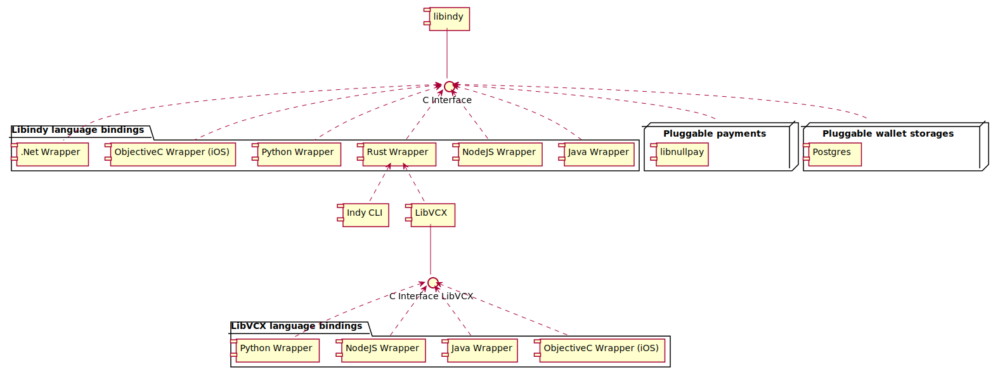

# Language Bindings in SDK

Libindy has a set of wrappers that convert its patterns to comply the best practices of corresponding languages.

There is some more detailed information about these wrappers:
* Java -- [Sources](https://github.com/hyperledger/indy-sdk/tree/master/wrappers/java) -- [Samples](https://github.com/hyperledger/indy-sdk/tree/master/samples/java)
* Python -- [Sources](https://github.com/hyperledger/indy-sdk/tree/master/wrappers/python) -- [Samples](https://github.com/hyperledger/indy-sdk/tree/master/samples/python)
* Rust -- [Sources](https://github.com/hyperledger/indy-sdk/tree/master/wrappers/rust) -- [Samples](https://github.com/hyperledger/indy-sdk/blob/master/libindy/tests/demo.rs)
* iOS -- [Sources](https://github.com/hyperledger/indy-sdk/tree/master/wrappers/ios)
* NodeJS -- [Sources](https://github.com/hyperledger/indy-sdk/tree/master/wrappers/nodejs) -- [Samples](https://github.com/hyperledger/indy-sdk/tree/master/samples/nodejs)
* .NET (not supported right now) -- [Sources](https://github.com/hyperledger/indy-sdk/tree/master/wrappers/dotnet) -- [Samples](https://github.com/hyperledger/indy-sdk/tree/master/samples/dotnet)

All wrappers support native logging -- you can read about it in wrapper's readme
